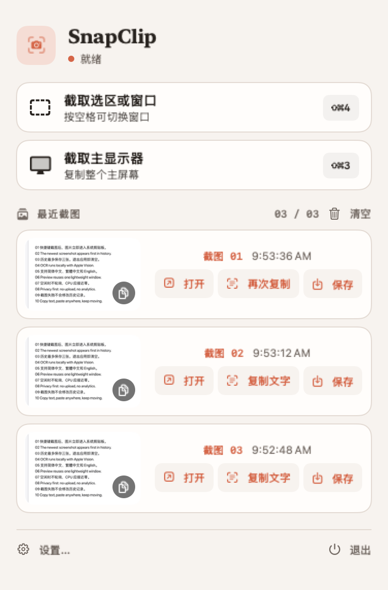

# SnapClip

<p align="center">
  <strong>把 macOS 系统截图键，变成一个只驻留菜单栏的临时截图工作台。</strong>
</p>

<p align="center">
  <a href="https://github.com/Evan1u/SnapClip"></a>
  <a href="https://github.com/Evan1u/SnapClip"></a>
  <a href="https://github.com/Evan1u/SnapClip"></a>
  <a href="https://github.com/Evan1u/SnapClip/releases/tag/v1.0.0"></a>
  <a href="LICENSE"></a>
</p>

<p align="center">
  
</p>

SnapClip 是一款面向 Apple Silicon、macOS 14+ 的原生菜单栏截图工具。按下熟悉的 `⇧⌘4` 或 `⇧⌘3`，截图会直接进入剪贴板，并在应用当前运行周期内保留最近三张。图片文字识别与实况文本选择均在本机完成。

没有账号、云端、分析统计或第三方运行时依赖。退出应用，截图历史随即清空。

## 它解决什么问题

macOS 的系统截图很可靠，但“截完立刻粘贴”“找回上一张”“从图片中复制一小段文字”通常分散在多个流程里。SnapClip 保留系统选区与窗口截图体验，只把结果收进一个轻量的菜单栏工作台：

1. 按系统截图键完成截图。
2. 图片自动写入剪贴板，无需先保存文件。
3. 最近三张随时可重新复制、打开、识别文字或保存到桌面。
4. 关闭 SnapClip 后，内存历史自动清空。

## 界面

<table>
  <tr>
    <td width="45%" align="center">
      
    </td>
    <td width="55%" align="center">
      
    </td>
  </tr>
  <tr>
    <td align="center"><sub>菜单栏工作台 · 最近三张截图</sub></td>
    <td align="center"><sub>设置 · 快捷键、行为与隐私状态</sub></td>
  </tr>
</table>

界面采用暖象牙、暖灰与珊瑚色的“暗房工作台”视觉，支持 macOS 浅色和深色模式。完整视觉规范见 [docs/brand-spec.md](docs/brand-spec.md)。

## 功能

- **接管系统截图键**：`⇧⌘4` 截取选区，按空格切换窗口；`⇧⌘3` 截取主显示器。SnapClip 运行时会阻止 macOS 再执行一次原截图动作，退出后系统行为自动恢复。
- **截图即复制**：成功截图后直接写入系统剪贴板，并提供音效与菜单栏图标反馈。
- **三项会话历史**：最新优先、最多三张；第 4 张自动淘汰最旧项，应用重启后历史为空。
- **图片内直接选字**：在预览窗口中拖选图片里的文字，通过右键或 `⌘C` 复制所选片段。
- **一键复制整图文字**：使用 Apple Vision 在本机识别简体中文、繁体中文和英文，结果仅在当前会话缓存。
- **保存到桌面**：按 `SnapClip yyyy-MM-dd HH.mm.ss.png` 命名；重名时自动追加序号，不覆盖已有文件。
- **可调设置**：重新录制两组全局快捷键、关闭截图音效、设置登录时启动或恢复默认值。
- **本地与轻量**：无轮询定时器、无网络请求、无持久截图数据库、零第三方运行时依赖。

## 下载

[下载 SnapClip v1.0.0（Apple Silicon）](https://github.com/Evan1u/SnapClip/releases/download/v1.0.0/SnapClip-v1.0.0-arm64.zip)

- 系统要求：Apple Silicon Mac、macOS 14 或更高版本。
- 文件：`SnapClip-v1.0.0-arm64.zip`，约 322 KiB。
- SHA-256：`69df2fff04ec8745666ab87bd5a756631d42b86182cd1421b611a58ee81ed5a7`

### 安装

1. 解压 ZIP，把 `SnapClip.app` 移到 `/Applications`。
2. 首次尝试打开后，如果 macOS 阻止运行，请前往 **系统设置 → 隐私与安全性**，在安全提示处选择 **仍要打开**。
3. 启动 SnapClip，按提示授予辅助功能与屏幕录制权限。

> `v1.0.0` 是未公证的 Pre-release。为了不在公开二进制中包含维护者证书邮箱，下载包采用 ad-hoc 签名；Gatekeeper 会把它视为未验证应用，未来更新后也可能需要重新授权。如果你需要自己的稳定签名身份、登录启动或更高信任级别，请从源码构建并选择自己的 Personal Team。

### 从源码运行

要求：Apple Silicon Mac、macOS 14 或更高版本，以及完整 Xcode。

```sh
git clone https://github.com/Evan1u/SnapClip.git
cd SnapClip
open SnapClip.xcodeproj
```

打开工程后：

1. 选择 SnapClip Target 的 **Signing & Capabilities**。
2. 将 **Team** 替换为你自己的 Personal Team；如有需要，同时替换默认 Bundle ID `com.local.SnapClip`。
3. 选择 **My Mac** 并运行。
4. 首次启动时按应用提示授予权限。

> 仓库保留维护者的 Team 配置，是为了让维护者本机的 TCC 权限身份在 Debug/Release 间保持稳定。该配置不包含证书或私钥，Fork 后必须选择自己的 Team。

## 为什么需要两项系统权限

| 权限 | 用途 | SnapClip 不会做什么 |
|---|---|---|
| 辅助功能 | 在运行期间拦截 `⇧⌘3/4`，触发 SnapClip 并阻止系统重复截图 | 不记录或保存其他按键，不修改系统快捷键偏好 |
| 屏幕与系统音频录制 | 允许系统截图工具读取屏幕画面 | 不录音、不持续录屏、不上传截图 |

OCR、实况文本与截图历史全部留在本机。SnapClip 没有账号、网络接口或分析统计。

<details>
<summary><strong>系统显示已授权，但截图仍被拒绝</strong></summary>

macOS 的屏幕录制权限会同时校验 Bundle ID 与代码签名身份。若此前运行过 ad-hoc 构建，请退出旧实例并重置旧记录：

```sh
tccutil reset ScreenCapture com.local.SnapClip
```

随后重新运行使用 Personal Team 签名的构建，并授权一次。不要切回 **Sign to Run Locally**，否则重编译后可能再次被系统识别为另一个应用。

</details>

## 开发与验证

正式构建入口是 `SnapClip.xcodeproj`。运行测试：

```sh
xcodebuild -project SnapClip.xcodeproj \
  -scheme SnapClip \
  -destination 'platform=macOS,arch=arm64' \
  -jobs 1 \
  test
```

`Package.swift` 仅用于无完整 Xcode 时做源码编译检查；正式 `.app`、XCTest、代码签名与系统权限验证均以 Xcode 工程为准。

### 技术结构

| 层 | 实现 |
|---|---|
| 菜单与设置 | SwiftUI `MenuBarExtra(.window)` |
| 剪贴板与预览窗口 | AppKit |
| 截图 | 系统 `/usr/sbin/screencapture` |
| 图片内选字 | VisionKit `ImageAnalysisOverlayView` |
| 整图 OCR | Vision |
| 系统键接管 | Core Graphics event tap |
| 自定义快捷键 | Carbon `RegisterEventHotKey` |
| 登录启动 | `SMAppService.mainApp` |

首版复用系统截图进程，因此不启用 App Sandbox，也不面向 Mac App Store。完整需求、异常边界、性能目标和验收标准见 [docs/PRD.md](docs/PRD.md)。

## 路线图

- 图片搜索与 ChatGPT 流程。
- 对外分发所需的 Developer ID 签名、公证和独立自动更新机制。
- 若未来进入 Mac App Store，将截图层迁移到 ScreenCaptureKit，并实现自定义选区界面。

图片搜索尚未进入首版，也没有隐藏的联网或上传逻辑。未来若接入 OpenAI API，必须使用 Keychain 保存 API Key，并在上传图片前明确提示费用、隐私与用户同意。

## 贡献

欢迎提交 Issue 或 Pull Request。涉及截图权限、快捷键、TCC、VisionKit 或签名的改动，请同时说明验证环境，并尽量补充自动化测试或可复现步骤。

## License

[MIT](LICENSE) © 2026 Evan Lu
