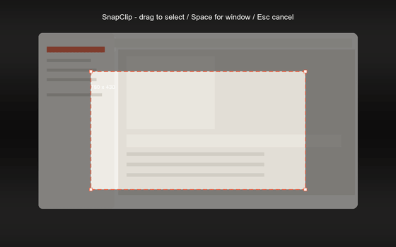
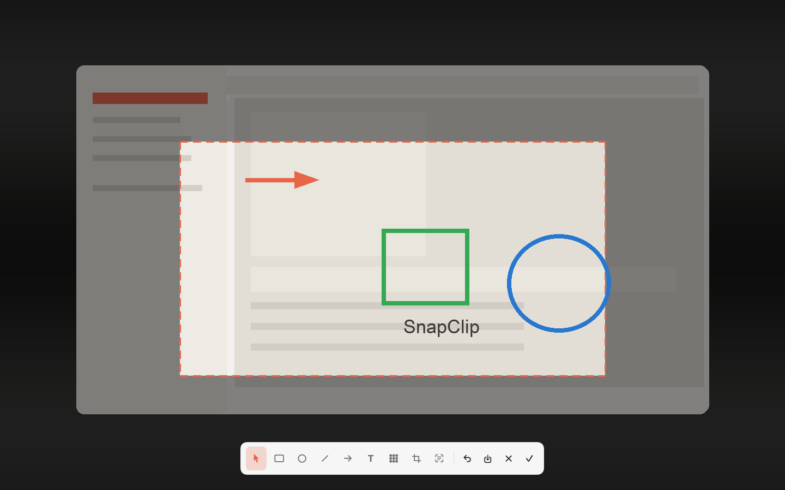
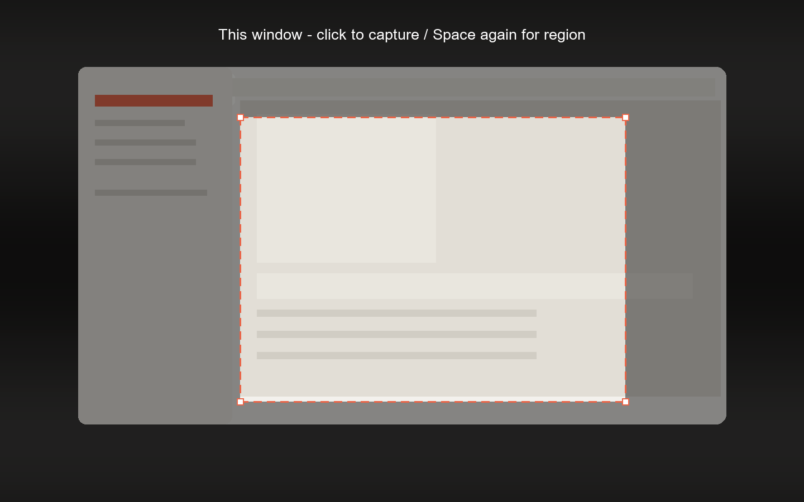

<div align="center">
  
  <h1>SnapClip</h1>
  <p><strong>把 macOS 系统截图键，变成一个只驻留菜单栏的原地截图工作台。</strong></p>
  <p>
    <a href="https://github.com/Evan1u/SnapClip"></a>
    <a href="https://github.com/Evan1u/SnapClip"></a>
    <a href="https://github.com/Evan1u/SnapClip"></a>
    <a href="https://github.com/Evan1u/SnapClip/releases/tag/v1.4.1"></a>
    <a href="LICENSE"></a>
  </p>
</div>

<p align="center">
  
</p>

<p align="center">
  
  <br>
  <sub>流程动图：选区 → 原地编辑（编辑器工具栏为真实 UI 渲染）</sub>
</p>

SnapClip 是一款面向 **Apple Silicon、macOS 14+** 的原生菜单栏截图工具。按熟悉的 `⇧⌘4` / `⇧⌘3`，屏幕会先冻结、变暗，框选或选中窗口后不会弹到独立编辑窗口，而是直接停留在你刚才框出的屏幕位置编辑。

确认后截图才写入剪贴板，并在应用运行期间保留最近三张。没有账号、没有云端、没有分析统计，OCR、二维码识别与实况文本也全部在本机完成；退出应用，历史立即清空。

## 核心流程

<table>
  <tr>
    <td align="center" width="25%"><strong>① 冻结</strong></td>
    <td align="center" width="25%"><strong>② 选择</strong></td>
    <td align="center" width="25%"><strong>③ 原地编辑</strong></td>
    <td align="center" width="25%"><strong>④ 确认复制</strong></td>
  </tr>
  <tr>
    <td align="center">触发快捷键后，所有显示器冻结并变暗</td>
    <td align="center">拖动框选；按空格切换窗口模式</td>
    <td align="center">工具栏吸附在原位置，标注不跳窗</td>
    <td align="center">双击或点 ✓，写入剪贴板与历史</td>
  </tr>
</table>

## 界面与流程

菜单栏工作台是真实 UI 渲染：顶部双截图入口、最近三张截图、复制/编辑/识别/保存操作都从这里出发。

<table>
  <tr>
    <td align="center" width="34%">
      
    </td>
    <td align="center" width="33%">
      
    </td>
    <td align="center" width="33%">
      
    </td>
  </tr>
  <tr>
    <td align="center"><sub>菜单栏工作台（真实 UI）</sub></td>
    <td align="center"><sub>选区示意：虚线珊瑚框 + 实时尺寸</sub></td>
    <td align="center"><sub>原地编辑示意：截图停留在原屏幕坐标</sub></td>
  </tr>
</table>

选区/编辑两张为简化流程示意图；菜单图为实际 SwiftUI 界面渲染。

<p align="center">
  
  <br>
  <sub>窗口模式示意：悬停高亮，点击即选窗</sub>
</p>

## 亮点

### 飞书式原地编辑

新截图不再打开独立窗口：

- 框选/选窗完成后，画面保留在原来的屏幕位置；
- 选区外继续冻结变暗，编辑内容不脱离截图上下文；
- 二次裁剪可以回到完整画面重新选择，支持扩大选择框，双击确认；
- 历史卡片“编辑”仍走独立窗口，历史与原地编辑互不干扰。

### 熟悉的标注工具

矩形、椭圆、直线、箭头、可旋转文字、马赛克、OCR 与二维码识别：

- 二次裁剪 / 文字原位输入 / 双击快速通过；
- 文字只在主动按回车时换行，不再被自动折行；
- 本地 Vision OCR 可直接拖选图片中的文字；
- 点击 OCR 旁的“二维码识别”，自动标出当前编辑画面里的一个或多个二维码；
- 点击识别框先预览内容：普通文本只提供复制，只有合法的 `http/https` 链接才显示“打开链接”，且不会自动跳转；
- 确认后才写剪贴板与历史，取消即全部丢弃。
- 右键分层退出：先退出当前工具或取消图形选中；空闲选择状态下再次右键，取消截图。裁剪中右键返回编辑。

### 三项会话历史

最新优先、最多三张；第 4 张自动淘汰最旧项。重启即清空，没有隐藏的持久化数据库。

### 完全本地

OCR、二维码扫描、实况文本、历史与标注合成全部在本机完成。SnapClip 没有账号、网络接口、分析统计或第三方运行时依赖；只有用户明确确认打开二维码链接后，才把该链接交给系统默认浏览器。

## 下载

<table>
  <tr>
    <td align="center">
      <a href="https://github.com/Evan1u/SnapClip/releases/download/v1.4.1/SnapClip-v1.4.1-arm64.dmg">
        <strong>DMG</strong><br><sub>SnapClip-v1.4.1-arm64.dmg</sub>
      </a><br>
      <sub><code>0bfc3391642a3ee5d6e533b9fc61ee4c67addb1e3472d7d71171bfc93ec9a45c</code></sub>
    </td>
    <td align="center">
      <a href="https://github.com/Evan1u/SnapClip/releases/download/v1.4.1/SnapClip-v1.4.1-arm64.zip">
        <strong>ZIP</strong><br><sub>SnapClip-v1.4.1-arm64.zip</sub>
      </a><br>
      <sub><code>49dfe8694d0892f270e6f5fd87e6cc826640850eb1598464416e21dc9fd94f52</code></sub>
    </td>
  </tr>
</table>

**系统要求**：Apple Silicon Mac、macOS 14 或更高版本。

> [!IMPORTANT]
> **从 GitHub 下载后若被 Gatekeeper 拦截（提示“无法验证开发者”或“已损坏”），不要直接双击报错关闭。**
> 请 **右键点击 `SnapClip.app` → 打开**，或前往 **系统设置 → 隐私与安全性**，在下方安全提示中选择 **仍要打开**。
>
> 当前下载包是未公证的 **ad-hoc 签名 Pre-release**，适合本机/个人使用；面向其他设备分发时，请从源码构建并选择自己的 **Developer ID** 或 **Personal Team**。

### 安装

1. 打开 DMG，把 `SnapClip.app` 拖进 `Applications`。
2. 首次打开若被 Gatekeeper 阻止，前往 **系统设置 → 隐私与安全性**，选择 **仍要打开**。
3. 启动 SnapClip，按提示授予辅助功能与屏幕录制权限。

### 自动更新脚本

从源码克隆仓库后，可以用脚本检查并安装最新 GitHub Release（包括 Pre-release）：

```sh
./scripts/update-snapclip.sh --check
./scripts/update-snapclip.sh
```

更新前，脚本会核对 GitHub SHA-256、Bundle ID、版本、arm64 架构、代码签名及签名主体。只有全部通过才会退出并替换 `/Applications/SnapClip.app`；替换或重新启动失败时会恢复原版本。需要先查看完整动作而不下载或修改应用，可运行：

```sh
./scripts/update-snapclip.sh --dry-run
```

脚本不会创建常驻进程或定时任务，也不会静默联网。非标准安装位置可通过 `SNAPCLIP_APP_PATH` 指定；遇到 GitHub 匿名 API 限流时，可通过环境变量 `GITHUB_TOKEN` 提供访问令牌，脚本不会打印该令牌。

<details>
<summary><strong>关于 v1.4.1 的签名</strong></summary>

`v1.4.1` 是未公证的 Pre-release。当前公开下载包保留 Apple Development 签名；由于不是 Developer ID 公证版本，Gatekeeper 仍可能要求右键选择“打开”或在“隐私与安全性”中允许启动。

</details>

### 从源码运行

要求 Apple Silicon Mac、macOS 14+ 与完整 Xcode：

```sh
git clone https://github.com/Evan1u/SnapClip.git
cd SnapClip
open SnapClip.xcodeproj
```

打开工程后：

1. 在 SnapClip Target 的 **Signing & Capabilities** 中选择你自己的 Team（可同时替换默认 Bundle ID `com.local.SnapClip`）。
2. 选择 **My Mac** 运行。
3. 首次启动按应用提示授予权限。

仓库保留维护者的 Team 配置是为了让本机 TCC 权限身份在 Debug/Release 间保持稳定；该配置不包含证书或私钥，Fork 后请替换为自己的 Team。

## 权限说明

| 权限 | 用途 | SnapClip 不会做什么 |
|---|---|---|
| 辅助功能 | 运行期间接管 `⇧⌘3/4`，触发 SnapClip 并阻止系统重复截图 | 不记录其他按键，不修改系统快捷键偏好 |
| 屏幕录制 | 通过 ScreenCaptureKit 读取屏幕并冻结画面 | 不录音、不持续录屏、不上传截图 |

<details>
<summary><strong>系统显示已授权，但截图仍被拒绝</strong></summary>

macOS 的屏幕录制权限会同时校验 Bundle ID 与代码签名身份。若此前运行过 ad-hoc 构建，可重置旧记录：

```sh
tccutil reset ScreenCapture com.local.SnapClip
```

然后重新运行 Personal Team 签名的构建并授权一次。不要切回 **Sign to Run Locally**，否则重编译后可能被系统识别为另一个应用。

</details>

## 开发与验证

正式构建入口是 `SnapClip.xcodeproj`：

```sh
xcodebuild -project SnapClip.xcodeproj \
  -scheme SnapClip \
  -destination 'platform=macOS,arch=arm64' \
  -jobs 1 \
  test
```

`Package.swift` 只用于无完整 Xcode 时做源码编译检查；正式 `.app`、XCTest、代码签名与系统权限验证均以 Xcode 工程为准。

| 层 | 实现 |
|---|---|
| 菜单与设置 | SwiftUI `MenuBarExtra(.window)` |
| 截图 | ScreenCaptureKit 整屏冻结 + SnapClip 自有全屏选区/编辑 overlay |
| 编辑器 | AppKit `EditorCanvasView` + 共享 `EditorSessionCore` |
| 图片内选字 | VisionKit `ImageAnalysisOverlayView` |
| 整图 OCR | Vision |
| 二维码识别 | Vision QR 检测 + 本地内容预览与安全链接确认 |
| 系统键接管 | Core Graphics event tap |
| 自定义快捷键 | Carbon `RegisterEventHotKey` |
| 登录启动 | `SMAppService.mainApp` |

完整需求、异常边界与验收标准见 [docs/PRD.md](docs/PRD.md)，视觉规范见 [docs/brand-spec.md](docs/brand-spec.md)。

## 路线图

- 图片搜索与 ChatGPT 流程。
- 对外分发所需的 Developer ID 签名、公证与应用内自动更新机制。

图片搜索尚未进入当前版本，也没有隐藏的联网或上传逻辑。若未来接入 OpenAI API，会使用 Keychain 保存 API Key，并在上传前明确提示费用、隐私与用户同意。

## License

[MIT](LICENSE) © 2026 Evan Lu
